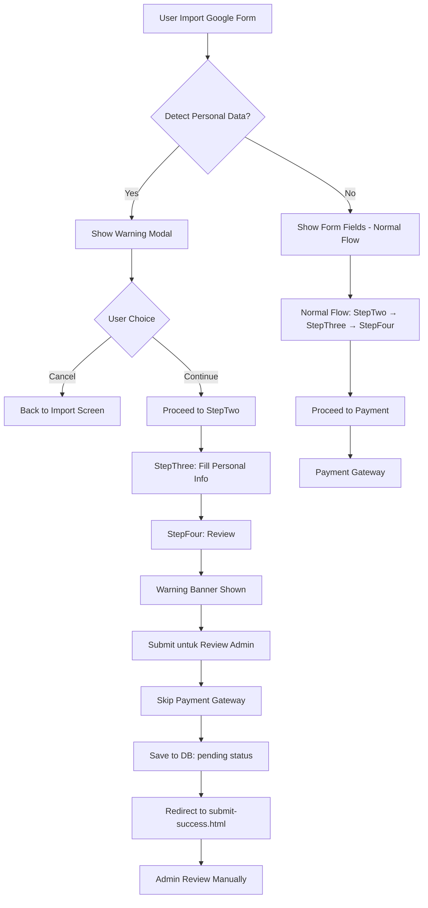

# Personal Data Detection & Warning System

## 📋 Overview

Sistem ini mendeteksi pertanyaan data pribadi dalam Google Form dan memberikan peringatan edukatif kepada user sesuai dengan Syarat & Ketentuan Jakpat for Universities.

## 🎯 Tujuan

1. **Edukasi**: Memberitahu user bahwa menanyakan data pribadi tidak diizinkan
2. **Compliance**: Memenuhi S&K Jakpat tentang perlindungan data pribadi responden
3. **Transparansi**: User tahu bahwa form akan direview admin jika mengandung data pribadi
4. **Fleksibilitas**: User tetap bisa submit untuk review admin (tidak ditolak langsung)

## 🔍 Cara Kerja

### 1. **Detection Phase** (Saat Import Google Form)

Ketika user import Google Form dari Google Drive:

```typescript
// File: src/workers/form-extractor.worker.ts
// File: src/utils/google-forms-api-browser.ts

// Keyword yang dideteksi:
const keywords = [
  'email', 'e-mail', 'alamat email',
  'nomor hp', 'nomor telepon', 'no hp', 'no telp', 'whatsapp', 'wa',
  'nik', 'nomor induk', 'ktp',
  'alamat rumah', 'alamat tinggal',
  'nama lengkap', 'full name' // (hanya jika diperlukan)
];
```

Sistem akan:
- Scan semua pertanyaan di Google Form
- Detect keyword data pribadi
- Set `hasPersonalDataQuestions: true` jika terdeteksi
- Simpan `detectedKeywords: ['email', 'nomor hp', ...]`

### 2. **Warning Phase** (StepOne - Setelah Import)

**File**: [src/components/PersonalDataWarningModal.tsx](src/components/PersonalDataWarningModal.tsx)

Modal warning muncul dengan informasi:

✅ **Keyword yang terdeteksi** (badge/chips)
⚠️ **Peringatan**: Tidak diizinkan menanyakan data pribadi
📋 **Kebijakan Jakpat**: Penjelasan S&K
🔍 **Apa yang terjadi**: Form akan direview admin, tidak ada payment
✅ **Rekomendasi**: Edit form dan hapus pertanyaan data pribadi
🔗 **Link**: Syarat & Ketentuan lengkap

**User dapat memilih**:
- **"Kembali & Edit Form"**: Cancel import, user edit form di Google
- **"Lanjutkan untuk Review Admin"**: Continue dengan form yang ada

### 3. **Review Phase** (StepFour - Sebelum Submit)

**File**: [src/components/StepFour.tsx](src/components/StepFour.tsx)

Warning banner ditampilkan di Step 4:

```
⚠️ Form Anda Mengandung Data Pribadi - Memerlukan Review Admin

Terdeteksi pertanyaan tentang: email, nomor hp, whatsapp

Form ini akan direview manual oleh admin sebelum dipublikasikan.
Anda tidak perlu melakukan pembayaran saat ini.

💡 Tips: Untuk proses otomatis, edit Google Form dan hapus pertanyaan data pribadi.
```

**Button berubah**:
- Normal: 💳 Proceed to Payment
- Has personal data: 📋 Submit untuk Review Admin (warna orange)

### 4. **Submission Phase** (StepFour - Submit)

**Logic** di [StepFour.tsx:116-144](src/components/StepFour.tsx#L116-L144):

```typescript
if (formData.hasPersonalDataQuestions) {
  // Skip payment gateway
  // Save to database with status "pending"
  // Send to Google Sheets untuk admin review
  // Toast: "Form telah dikirim untuk review admin"
  // Redirect ke submit-success.html (bukan payment)
}
```

## 📁 File Structure

```
src/
├── components/
│   ├── PersonalDataWarningModal.tsx    # NEW - Modal warning component
│   ├── GoogleDriveImportSimple.tsx     # UPDATED - Integrate warning modal
│   ├── StepFour.tsx                    # UPDATED - Warning banner + logic
│   └── ...
├── types.ts                             # hasPersonalDataQuestions, detectedKeywords
├── workers/
│   └── form-extractor.worker.ts        # Detection logic
└── utils/
    └── google-forms-api-browser.ts     # Detection logic
```

## 🔄 Complete User Flow



## 🎨 UI/UX Features

### Modal Warning (StepOne)
- ⚠️ Yellow theme (warning, not error)
- Clear icon dan visual hierarchy
- Bullet points untuk kebijakan
- Badge untuk detected keywords
- 2 CTA buttons dengan contrast jelas

### Banner Warning (StepFour)
- Consistent yellow theme
- Inline dengan layout existing
- Tidak mengganggu review form
- Tips box untuk alternatif solution

### Button Changes (StepFour)
- Dynamic text berdasarkan `hasPersonalDataQuestions`
- Orange background untuk submission with personal data
- Clear CTA yang berbeda: "Payment" vs "Review Admin"

## 🛡️ Data Privacy & Compliance

### Prinsip
1. **Transparansi**: User tahu apa yang terjadi
2. **Edukasi**: User diberi tahu kenapa tidak boleh
3. **Fleksibilitas**: User tetap bisa submit (admin decision)
4. **Legal Protection**: Jakpat sudah memberi warning & disclaimer

### Database
**Note**: Field `hasPersonalDataQuestions` dan `detectedKeywords` **TIDAK tersimpan** di database saat ini.

**Rekomendasi untuk future**:
```sql
ALTER TABLE form_submissions
ADD COLUMN has_personal_data_questions BOOLEAN DEFAULT false,
ADD COLUMN detected_keywords TEXT[];
```

Ini berguna untuk:
- Analytics: Berapa % form yang mengandung personal data
- Audit trail: Record untuk compliance
- Admin dashboard: Filter form yang perlu review

## 🧪 Testing Checklist

### Test Scenario 1: Form WITHOUT Personal Data
- [ ] Import form normal
- [ ] No warning modal
- [ ] StepFour: Normal payment flow
- [ ] Button: "Proceed to Payment"
- [ ] Redirect to payment gateway

### Test Scenario 2: Form WITH Personal Data
- [ ] Import form dengan keyword personal data
- [ ] Warning modal muncul
- [ ] User click "Lanjutkan"
- [ ] StepFour: Warning banner shown
- [ ] Button: "Submit untuk Review Admin" (orange)
- [ ] Click submit → Skip payment
- [ ] Toast: "Form telah dikirim untuk review admin"
- [ ] Redirect to submit-success.html

### Test Scenario 3: User Cancel Warning
- [ ] Import form dengan personal data
- [ ] Warning modal muncul
- [ ] User click "Kembali & Edit Form"
- [ ] Modal close
- [ ] Toast info: "Silakan edit Google Form..."
- [ ] User stay at import screen

## 🚀 Deployment

### Build Success ✅
```bash
npm run build
# ✓ built in 5.04s
```

### Deploy to Production
```bash
cd multi-step-form
npm run build
npx wrangler pages deploy dist --project-name=jakpatforuniv-submit-survey
```

## 📝 Notes for Admin

### Manual Review Process
Ketika form dengan personal data masuk:

1. **Check Google Sheets** atau **Admin Dashboard**
2. **Filter** by: `payment_status = 'pending'` dan memiliki personal data
3. **Review form** di Google Form URL
4. **Decision**:
   - ✅ **Approve**: Hubungi user via email/phone untuk payment
   - ❌ **Reject**: Hubungi user untuk edit form

### Communication Template

**Approval Email**:
```
Subject: Survey Anda Telah Disetujui - Jakpat for Universities

Halo [Name],

Survey Anda "[Title]" telah direview dan disetujui oleh tim kami.

Untuk melanjutkan publikasi survey, silakan lakukan pembayaran:
Total: Rp [amount]
Link Payment: [payment_link]

Terima kasih!
Tim Jakpat for Universities
```

**Rejection Email**:
```
Subject: Survey Memerlukan Revisi - Jakpat for Universities

Halo [Name],

Survey Anda "[Title]" mengandung pertanyaan data pribadi yang tidak diizinkan.

Pertanyaan yang terdeteksi: [keywords]

Mohon edit Google Form Anda dan hapus pertanyaan tersebut,
kemudian submit ulang di platform kami.

Terima kasih atas pengertiannya!
Tim Jakpat for Universities
```

## 🔮 Future Enhancements

### Phase 2
- [ ] Simpan `hasPersonalDataQuestions` dan `detectedKeywords` ke database
- [ ] Admin dashboard untuk review pending forms
- [ ] Auto-email notification ke admin saat ada submission dengan personal data
- [ ] One-click approve/reject dari admin dashboard

### Phase 3
- [ ] Machine learning untuk deteksi lebih akurat
- [ ] Support multi-language detection (EN, ID)
- [ ] Suggest alternative phrasing untuk pertanyaan
- [ ] Integration dengan consent management platform

## 🆘 Troubleshooting

### Warning Modal Tidak Muncul
- Check browser console untuk error
- Pastikan `hasPersonalDataQuestions` dan `detectedKeywords` ada di formData
- Check [GoogleDriveImportSimple.tsx](src/components/GoogleDriveImportSimple.tsx)

### Keyword Tidak Terdeteksi
- Update keyword list di [form-extractor.worker.ts](src/workers/form-extractor.worker.ts)
- Test dengan form yang pasti ada keyword
- Check console log: `[Worker] Keyword detection result`

### Form Tetap Masuk Payment
- Check logic di [StepFour.tsx:116](src/components/StepFour.tsx#L116)
- Pastikan `formData.hasPersonalDataQuestions === true`
- Check console log: "Form needs admin review"

## 📚 References

- [Syarat & Ketentuan Jakpat](https://jakpatforuniv.com/syarat-ketentuan)
- [Privacy Policy](https://jakpatforuniv.com/privacy-policy)
- [UU Perlindungan Data Pribadi Indonesia](https://peraturan.go.id/id/uu-no-27-tahun-2022)

---

**Last Updated**: 2025-01-24
**Version**: 1.0.0
**Status**: ✅ Production Ready
